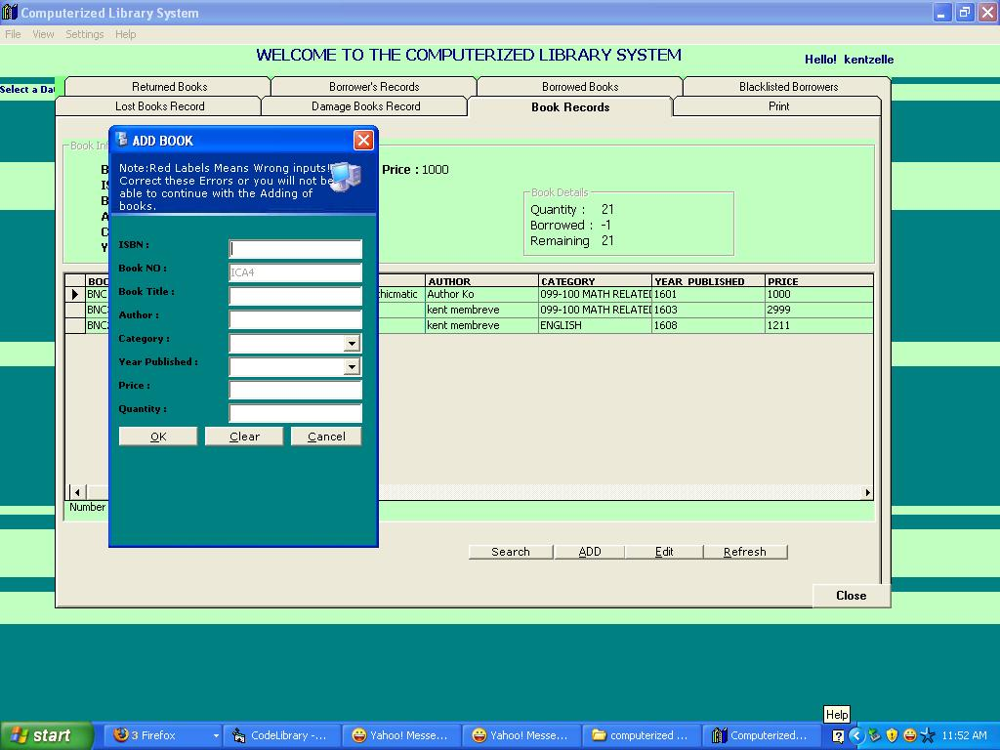



## Computerized library system

### Description

my code can calculate and operate library processes. it is fully automated and user friendly
 
### More Info
 
errors will procure if you use the add functions with an empty database, make the first entry at the ms access.

             |
---                |---
**Submitted On**   |2008-12-15 02:41:10
**By**             |[kent membreve](https://github.com/Planet-Source-Code/PSCIndex/blob/master/ByAuthor/kent-membreve.md)
**Level**          |Intermediate
**User Rating**    |4.8 (19 globes from 4 users)
**Compatibility**  |VB 6\.0, VBA MS Access
**Category**       |[Complete Applications](https://github.com/Planet-Source-Code/PSCIndex/blob/master/ByCategory/complete-applications__1-27.md)
**World**          |[Visual Basic](https://github.com/Planet-Source-Code/PSCIndex/blob/master/ByWorld/visual-basic.md)
**Archive File**   |[Computeriz21381912252008\.zip](https://github.com/Planet-Source-Code/kent-membreve-computerized-library-system__1-71568/archive/master.zip)

